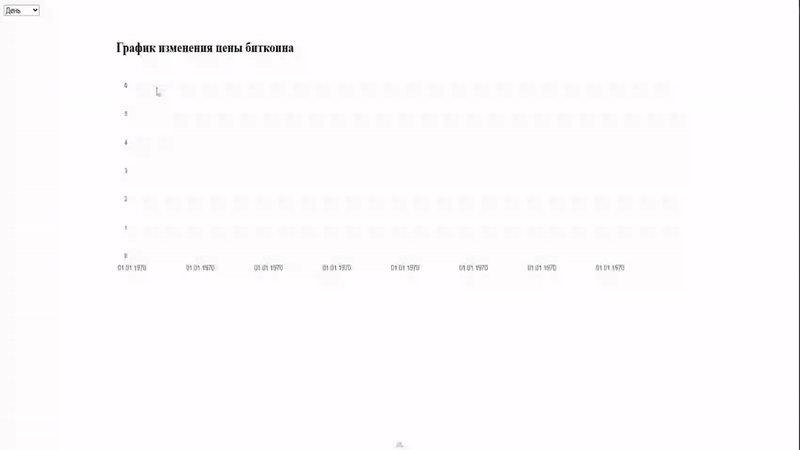

# Bitcoin Chart
<br /><br />
_Приложение, отображающее исторические данные по цене биткойна в разрезе периодов(день, неделя, месяц, год, пользовательский).<br />
Данные(кроме дневного периода) поступают с бекэнда (postgresql). Бекэнд получает данные из апи CoinCap.<br />
Данные по дневному периоду берутся напрямую с апи CoinCap(на момент создания приложения CoinCap <br />
не требовал ключа и регистрации)._<br /><br />

## Демонстрация



*Пример работы приложения с графиком биткоина.

# Technologies
```Vue```
```Pinia```
```Nuxt 3```
```Typescript```
```Moment```
```Axios```
```Express```
```Cron```
```Postgresql```
```Postgresql Node(pg)```
```ApexCharts```

```bash
# установить зависимости(в папках client, server и корневой папке)
$ npm i

# из корневой папки
$ npm start